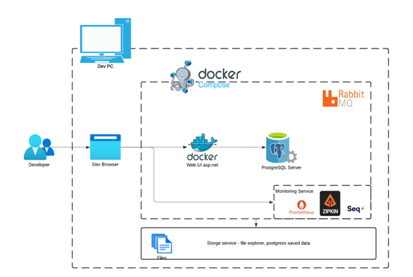

# Shopping Platform – Online Tech Store
known in repo as Project-Tech-Shop

## Description

A shopping website focused on technology products where users can browse items, add them to their cart, and complete purchases. This platform will provide a specialized experience for tech enthusiasts looking for hardware, gadgets, and accessories.

## Technologies Used

- **HTML/CSS:** To craft a visually appealing and intuitive user interface.
- **AngularJS/React:** Chosen for the frontend framework to handle state and user interactions dynamically.
- **ASP.NET MVC:** Utilized for the backend to implement the MVC architecture for clean code organization.
- **Entity Framework:** For database operations, using its ORM capabilities to simplify data access.
- **PostgreSQL:** As a robust database system compatible with Entity Framework.
- **JSON:** For efficient data exchange between the frontend and backend.
- **RabbitMQ:** To handle asynchronous tasks and improve overall performance by decoupling heavy operations.

## Features

- **Product Listings:** Users can filter and sort products by various criteria like category, price, and brand.
- **Shopping Cart:** Allows items to be added or removed, with a persistent state for a seamless experience.
- **User Authentication:** Secure login and role-based authorization to safeguard user actions.
- **Security:** Protection against common web threats like SQL Injection and XSS, employing ASP.NET MVC's security features.

## Developer Architecture

The local development environment reflects the expected deployment architecture, facilitating an easier transition into a CI/CD pipeline and Kubernetes services. The Docker Compose orchestrates various services, including RabbitMQ, PostgreSQL, Seq, Prometheus with Grafana, and Zipkin, along with managing persistent data volumes.